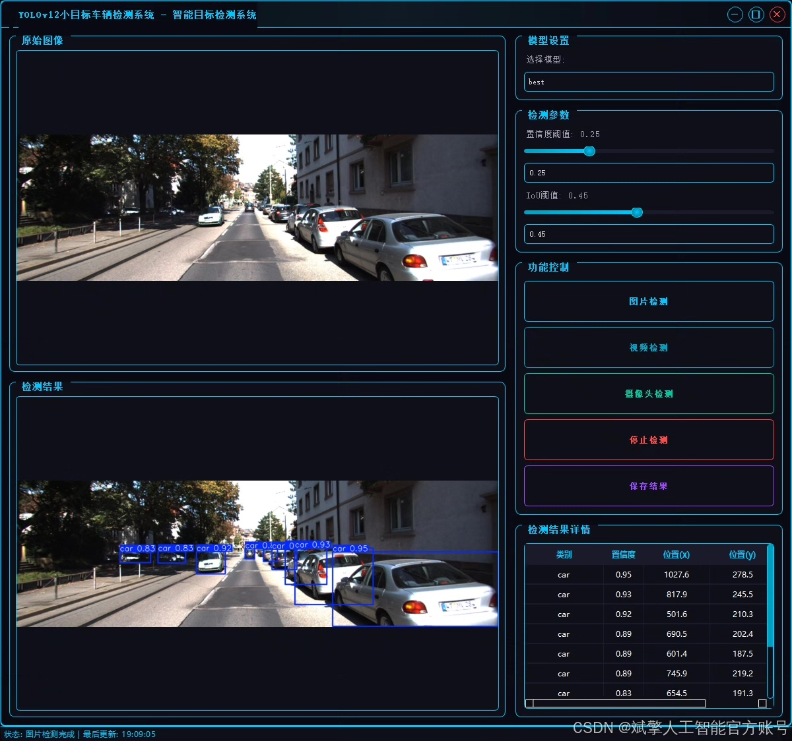
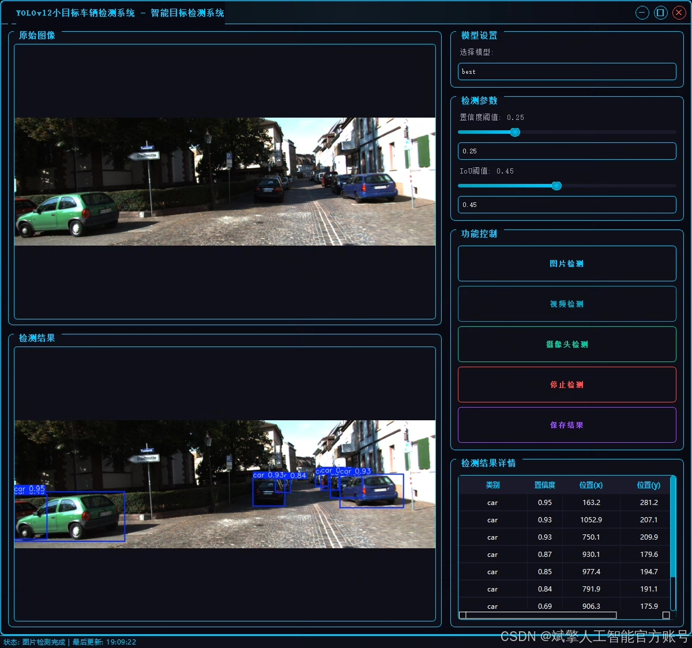
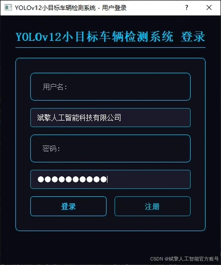
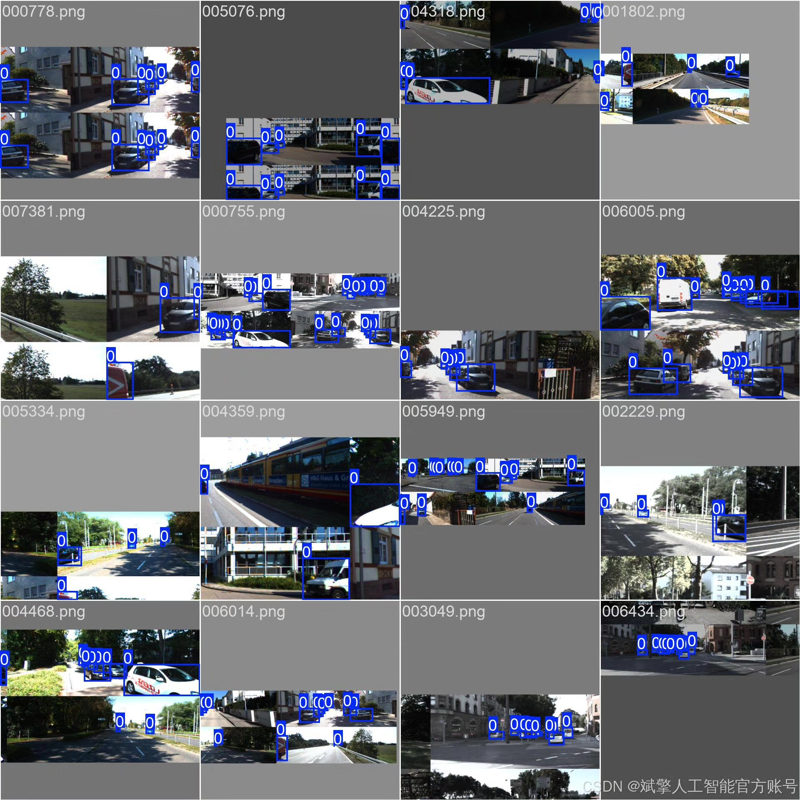
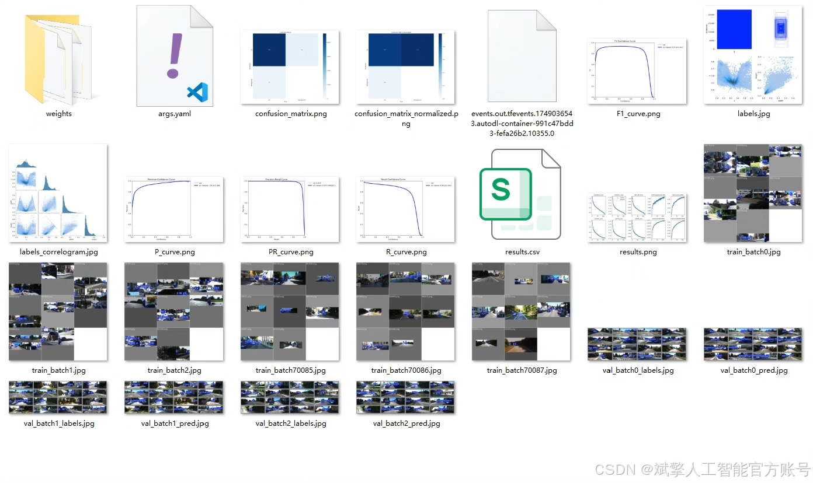
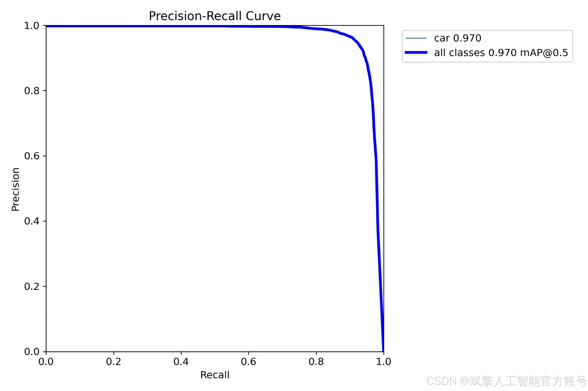
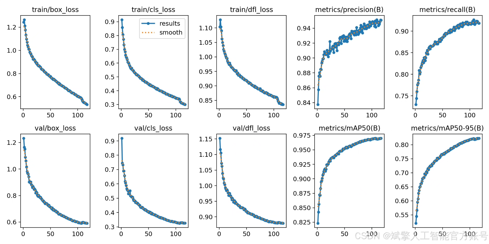
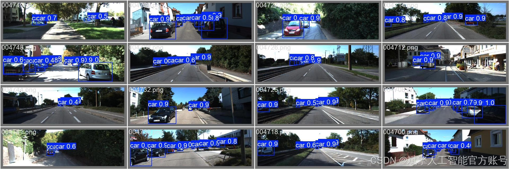

# YOLOv12 Small Object Vehicle Detection System

## Body

YOLOv12 Small Object Vehicle Detection System Based on Deep Learning YOLOv12: A High-Accuracy Detection System for Small Object Vehicles (YOLOv12+YOLO dataset + UI interface + login and registration interface + Python project source code + model)

This paper designs and implements a high-precision detection system for small object vehicles based on the YOLOv12 deep learning framework. The system employs an improved YOLOv12 algorithm, combined with a specialized vehicle dataset containing 5236 training images and 2245 validation images, to optimize the performance of small object detection. It integrates a user-friendly UI interface and login/registration functions. Experiments show that the system achieves practical levels in accuracy and real-time performance for detecting small object vehicles under complex scenarios. This paper elaborates on the model construction, data set processing, system design, and optimization strategies, providing complete Python project source code and pre-trained models, offering a reusable solution for small object detection tasks in intelligent transportation and autonomous driving fields.

✅ User Login and Registration: Supports password verification and security validation.
✅ Three Detection Modes: Based on the YOLOv12 model, supports image, video, and real-time camera detection, accurately recognizing targets.
✅ Dual-Screen Comparison: Displays the original scene and detection results simultaneously on the screen.
✅ Data Visualization: Real-time table displays the category, confidence, and coordinates of detected targets.
✅ Intelligent Parameter Tuning: Offers a confidence slide bar to dynamically optimize detection accuracy, adapting to different scene needs.
✅ Sci-Fi Interactive Interface: Dark theme paired with dynamic light effects, reducing visual fatigue and enhancing operational experience.

## Images

## Payment

Here is a pay link on Stripe ( https://buy.stripe.com/3cs8yP7sY87d0vu9AB ). Please contact me lonlonago@foxmail.com after funding $89, and I will send you a complete data files , thank you!

